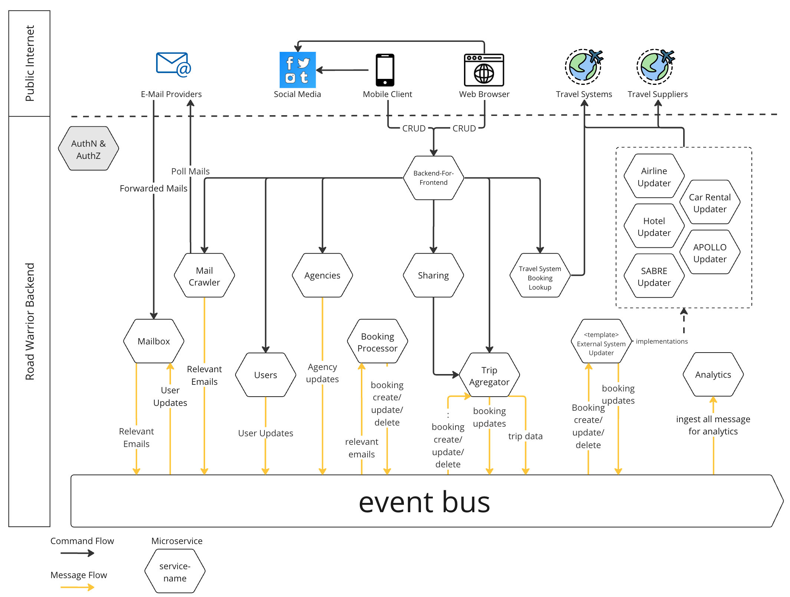

<!-- TOC -->
* [Problem Statement](#problem-statement)
  * [Requirements](#requirements)
    * [Functional Requirements](#functional-requirements)
    * [Nonfunctional Requirements](#nonfunctional-requirements)
  * [Use Cases](#use-cases)
* [Architectural Considerations](#architectural-considerations)
  * [Architectural Characteristics](#architectural-characteristics)
  * [Architectural Style](#architectural-style)
  * [Client Architecture](#client-architecture)
* [Business Domain](#business-domain)
* [Events](#events)
* [System Overview](#system-overview)
* [Components](#components)
  * [Event Bus](#event-bus)
  * [Databases](#databases)
  * [Authentication & Authorization](#authentication--authorization)
  * [Users](#users)
  * [Agencies](#agencies)
  * [Mail Crawler](#mail-crawler)
  * [Mailbox Service](#mailbox-service)
  * [Booking Processor](#booking-processor)
    * [Travel Information Extraction](#travel-information-extraction)
  * [Trip Aggregator](#trip-aggregator)
  * [External Systems Updater](#external-systems-updater)
  * [Sharing](#sharing)
  * [Analytics](#analytics)
  * [Backend for Frontend](#backend-for-frontend)
* [Deployment Considerations](#deployment-considerations)
* [ADRs](#adrs)
<!-- TOC -->

# Problem Statement

The requirements for the kata architecture document says this about the company and the product that has to be
architected:

> A new startup wants to build the next generation online trip management dashboard to allow travelers to see all of
> their
> existing reservations organized by trip either online (web) or through their mobile devices.

Given that nobody from Road Warrior is available at the time of design, assumptions have to be made along the way.
These will be marked accordingly.

## Requirements

All requirements were taken from the initial Road Warrior requirements document and separated between functional and
nonfunctional
requirements. After some requests for clarifications,
another [Q&A document](https://docs.google.com/document/d/1xHpte5IOjMEBA39211Z3uUwl1p5yXJ7PrCGKUmTmwQE/edit) was
provided that led to more or altered requirements
that were derived from the answer. These requirements are marked with an asterisk *.

### Functional Requirements

| Id    | Requirement                                                                                                                                                                                                                                                                |
|-------|----------------------------------------------------------------------------------------------------------------------------------------------------------------------------------------------------------------------------------------------------------------------------|
| FR01  | Poll email looking for travel-related emails                                                                                                                                                                                                                               |
| FR02  | Filter and whitelist certain emails                                                                                                                                                                                                                                        |
| FR03  | The system must interface with the agency’s existing airline, hotel, and car rental interface system to update travel details (delays, cancellations, updates, gate changes, etc.). Updates must be in the app within 5 minutes of an update (better than the competition) |
| FR04  | Customers should be able to add, update, or delete existing reservations manually as well                                                                                                                                                                                  |
| FR05  | Items in the dashboard should be able to be grouped by trip, and once the trip is complete, the items should automatically be removed from the dashboard.                                                                                                                  |
| FR06  | Users should also be able to share their trip information by interfacing with standard social media sites or allowing targeted people to view your trip.                                                                                                                   |
| FR07  | Provide end-of-year summary reports for users with a wide range of metrics about their travel usage                                                                                                                                                                        |
| FR08  | Road Warrior gathers analytical data from users' trips for various purposes - travel trends, locations, airline and hotel vendor preferences, cancellation and update frequency, and so on.                                                                                |
| FR09  | Must integrate seamlessly with existing travel systems (i.e. SABRE, APOLLO)                                                                                                                                                                                                |
| FR10* | Must integrate with a preferred agency for quick problem resolution (help me!). If a booking was received from an agency, the contact information from this agency should be used                                                                                          |
| FR11* | Users should have the possibility to forward mails to the Road Warrior system                                                                                                                                                                                              |

### Nonfunctional Requirements

| Id    | Requirement                                                                                                                                     |
|-------|-------------------------------------------------------------------------------------------------------------------------------------------------|
| NFR01 | The system should serve two million active users/week and a total of 15 million user accounts                                                   |
| NFR02 | Travel updates must be presented in the app within 5 minutes of generation by the source                                                        |
| NFR03 | Response time from web (800ms) and mobile (First-contentful paint of under 1,4 sec)                                                             |
| NFR04 | Richest user interface possible across all deployment platforms                                                                                 |
| NFR05 | Users must be able to access the system at all times (max 5 minutes per month of unplanned downtime) which translates to a SLA of 99.99% uptime |
| NFR06 | Must work internationally                                                                                                                       |

## Use Cases

From the given requirements, the following use cases have been derived

| Id     | Requirement                                                                                                             |
|--------|-------------------------------------------------------------------------------------------------------------------------|
| USEC01 | User can register, login and manage their account                                                                       |
| USEC02 | User can add and remove their email access credentials                                                                  |
| USEC03 | User can view trips (=set of bookings)                                                                                  |
| USEC04 | User can manually add / remove / update a booking                                                                       |
| USEC05 | User can see contact details of a travel agency managing the trip (help me)                                             |
| USEC06 | User can create a sharing link of a trip for another user                                                               |
| USEC07 | User receives a yearly report based on user data                                                                        |
| USEC08 | User can filter out some emails                                                                                         |
| USEC09 | System polls each user email every 5 minutes or less                                                                    |
| USEC10 | System inserts bookings additions/updates from emails                                                                   |
| USEC11 | System inserts bookings additions/updates from external travel agencies (SABRE, APOLLO, ..) and company existing system |
| USEC12 | System provides analytics data based on user trips                                                                      |

# Architectural Considerations

## Architectural Characteristics

Based on the requirements and with the help of
the [Architectural Characteristics Worksheet](https://developertoarchitect.com/resources.html) following characteristics
were identified.

| Id   | Top3 | Characteristic  | Source                                                                                   |
|------|------|-----------------|------------------------------------------------------------------------------------------|
| AC01 | x    | availability    | NFR02 NFR05 SLA 99,99% uptime                                                            |
| AC02 | x    | scalability     | NFR1 The systems must be able to handle a large amount of users and their mailboxes      |
| AC03 |      | security        |                                                                                          |
| AC04 |      | extensibility   | FR03, FR06 & FR09 It should be easy to add new travel systems and social media platforms |
| AC05 | x    | responsiveness  | NFR03 & NFR06 Ensure low latency all over the globe for frontend clients                 |
| AC06 |      | observability   |                                                                                          | |
| AC07 |      | fault tolerance |                                                                                          | |
| AC08 |      | usability       | NFR04 Use native apps for mobiles to guarantee best possible user experience             |

## Architectural Style

The identified architectural characteristics were matched against
the [Architecture Style](https://developertoarchitect.com/resources.html)
worksheet. Based on the top characteristics AC01, AC02 and AC05 it was decided and documented
in [ADR-0001 Event Driven Microservice Architecture](docs/adr/0001-event-driven-microservice-architecture.md)
that a event driven microservice based approach is taken.

## Client Architecture

In order to satisfy usability needs (AC08) and provide the richest possible user interface (NFR04), clients should
use a native implementation to its platform. This was documented
in [ADR-0004 Native Clients](docs/adr/0004-native-clients.md).

To optimize communication between clients and the backend, a backend for frontend approach is
used ([ADR-0005 Backend for Frontend](docs/adr/0005-backend-for-frontend.md)).

Mobile clients should utilize a local database in order to avoid possible data loss and improve responsiveness
in low reception areas.

# Business Domain

In order to have a clear wording in the following descriptions, it is necessary to establish all important entities that
live in
the Road Warrior business domain. During the Kata it was not possible to speak to a domain expert nor was there enough
time
to dive deeply into the domain.

| Name            | Description                                                                                                                                           |  
|-----------------|-------------------------------------------------------------------------------------------------------------------------------------------------------|
| User            | The customer that uses the product. Owner of trips and bookings.                                                                                      |
| Agency          | Provides public services to the user in order to book and manage flights, hotels or cars or manage bookings for a whole trip (using travel suppliers) |
| Travel Supplier | Information system of an airline/hotel/car rental that allows to book stuff                                                                           |
| Booking         | A single reservation of a flight, hotel or car                                                                                                        |
| Confirmation Id | Id a user receives upon a successful reservation, can be used to lookup booking information via a travel system                                       |
| Trip            | Collection of one or more bookings that belongs logically together, e.g. all bookings for “summer vacation 2023”                                      |
| Travel System   | Information system that integrates with airlines, hotels, car rentals in order to provide a unified interface managing bookings, e.g. SABRE, APOLLO   |

# Events

| Name                  | Description                                                                                |  
|-----------------------|--------------------------------------------------------------------------------------------|
| AgencyCreated         | New agency was added                                                                       |
| AgencyUpdated         | Agency information was updated                                                             |
| AgencyDeleted         | Agency was deleted                                                                         |
| BookingCreated        | A new booking was created                                                                  |
| BookingUpdated        | Booking information was updated                                                            |
| BookingCanceled       | Booking was canceled                                                                       |
| BookingArchieved      | Booking was archived e.g. because trip is over                                             |
| BookingDeleted        | Booking was deleted by the user                                                            |
| BookingUpdateReceived | Updates for a booking were received by mail or external system                             |
| RelevantEmailReceived | Signals that a mail was received that contains booking information and should be processed |
| SharedTripCreated     | A Trip was shared                                                                          |
| SharedTripDeleted     | Sharing of a trip was revoked                                                              |
| TripCreated           | New trip was created                                                                       |
| TripUpdated           | Trip information was updated                                                               |
| TripArchived          | Trip was archived because e.g. all bookings are over                                       |
| TripDeleted           | Trip was deleted by user                                                                   |
| UserCreated           | New user was created                                                                       |
| UserUpdated           | User information was updated                                                               |
| UserDeleted           | User was deleted                                                                           |

# System Overview

The following diagram gives an overview of the whole services structure and interaction between services, the message
bus
and external systems. Later on all components are described in more detail.

# Components

## Event Bus

All events are exchanged through the event bus system. It is the heart of an event driven architecture. The Road Warrior
architecture does not require any special features in this regard. A messaging system like RabbitMQ or ApacheMQ is ok
for
the job.

If no particular system is preferred due to internal knowledge it is advised however to use Apache Kafka. A high volume
of
messages is expected that have to processed in a short amount of time. Kafka provides the following benefits

- High throughput with relatively low hardware needs
- Easily scalable
- Many tools for data processing and analytics integrate with Kafka

## Databases

No special database type is required for information storage. Take into consideration what employees are
already used to and have knowledge in.

## Authentication & Authorization

AuthN and AuthZ is enforced in the whole system. Many systems exist already that accommodate this problem space,
therefore an
existing solution provider like Auth0 or AWS Cognito should be used for this purpose.

## Users

Handles registration and deletion of users. Interfaces with the chosen Authentication solution to update user details.
Publishes messages in order to notify other services about changes, especially when a users decides to delete the
account.

## Agencies

Stores agencies that are registered with us. Later on a synchronization option with an agency database can be thought
of.
The agency information is used to provide the user with the help me functionality (FR10) and stores an agency fallback
for
the case that a booking has no agency information asociated with.

## Mail Crawler

This component is responsible for ingesting Emails into the Road Warrior system. The system polls for new emails in each
configured mail account, filters them and publishes a RelevantEmailReceived message to the message bus. There is also
the
possibility to whitelist email senders that should always be processed.

A main concern for this component is the possibility to scale with a rising user base. Even mailboxes of users that are
not active on the platform for some time have to be scanned for new bookings. A job scheduler e.g. sidekiq is used to
coordinate the polling of all user mailboxes. Microservice instances should be scaled up in order to meet the targeted
maximum of 5 minutes for receiving new information.

## Mailbox Service

In order to enable a user to forward emails to the Road Warrior system, for new users (UserCreated events), a
RoadWarrior mailbox
is created that can only receive emails. The address is generic and contains a generated UUID,
e.g. roadwarrior+58359607-e946-4ace-80c3-021387862dd5@roadwarrior.com. Ideally a lightweight implementation
of a mail server is used to directly receive and process mails instead of using a polling mechanism like in the Mail
Crawler
component. Received mails are published via a RelevantEmailReceived event.

Using this mechanism, the user can simply forward wanted emails to the generated mailbox and there is no need to
provide credentials.

## Booking Processor

Receives RelevantEmailReceived events that were generated by other services e.g. mail crawler or the mailbox service.
It then attempts to extract booking information and generates a BookingUpdateReceived event.

### Travel Information Extraction

Typically all agencies add annotations to their mails. These can be viewed on schema.org, for example a schema for
Flight Reservation. All received events are scanned for these annotations. If there are existing ones, a mail is
deemed booking relevant and a standardized booking event with all booking relevant information will be published on
the event bus.
For later iterations of the service, it could be interesting to use other types of information extraction if no
annotations
are present.

## Trip Aggregator

Receives all updates about bookings from the booking processor and external system updaters. If a booking does not
already exist,
a new one is created. It is also tried to match a booking to an existing trip if available or create a new trip.

## External Systems Updater

Idea for this component is to create a service implementation for each travel system or travel supplier that should be
supported by the Road Warrior system. This enables implementations that are tailored to the needs of the respective
api (e.g. also notifications by an external system) and are scalable per target system. An updater listens to new
bookings and recognizes if it is intended for the updater’s target system. It then creates a reference in order to be
able to monitor the booking. If an update for a booking was received, a BookingDetailsUpdated event signals the updated
booking to the rest of the RoadWarrior system. Booking references are deleted if the booking was archived or deleted.

## Sharing

Provides an api to manage the sharing of a user’s trips. Upon request a hard to guess unique identifier is generated
that can be used to retrieve filtered details of a trip also via the sharing service.

Piping the view request through this service keeps all responsibilities within the sharing service and enables future
permission settings without the need to modify the trip aggregator service.

## Analytics

In order to satisfy FR08, this component ingests all available events that are created on the Road Warrior event bus.
All events should be stored in order to have the possibility to later on create better insights into trends, etc.

This component is depicted as a service to get things started, but indeed is probably later on a whole (sub) system.
Analytical data will be a backbone to support business decisions to generate revenue. Therefore it is advisable to
establish a data team early on that takes care of evolving this component.

## Backend for Frontend

In order to provide a platform tailored api to all clients, the Backend for frontend pattern is used. This decision
was documented in [ADR-0001 Backend for Frontend](docs/adr/0005-backend-for-frontend.md).

For simplicity all platforms are initially served from one BFF. If apis need to diverge too much or platform teams want
to take ownership of "their" apis, in the future the service might be separated by platform.

# Deployment Considerations

The depicted architecture is independent of the target platform and can be deployed on-premises as well as on any cloud
platform. It is assumed that Road Warrior, being a new startup, does not own any on-premises infrastructure.

In order to meet requirements for availability (NF01), scalability (NF02) and responsiveness (NF05) it is suggested to
use one of the big cloud providers. The use of a cloud platform has following advantages (upon many others):

- Minimal to no upfront cost for infrastructure provisioning
- Support of rapid growth (NF02)
- Reduction of maintenance effort by leveraging managed services (e.g. databases)
- Data centers around the world (NF01, NF05)

Most cloud providers group their data centers into geographic regions (e.g. frankfurt). Regions then typically consist
of three or more availability zones (AZ), being distinct data centers but co-located in this region. Typically direct
connectivity between AZs within a single region is given and resources can be easily managed within a region without
great architectural effort. Distributing resources across multiple regions is way more complex, introducing, among other
restrictions, higher cost, high(er) latency, no direct connectivity, etc. Multi region also introduces the need for a
more complex architecture.

The outage of a whole region (i.e. multiple availability zones/data centers) is very unlikely and does not yet warrant
the effort for a multi region architecture. The increased cost and maintenance effort would be too much for a new
startup. As the user base grows around the globe and also data protection laws might come into consideration, this
approach should be re-evaluated in the future.

In order to achieve high availability, all components should be distributed and scaled across multiple availability
zones. Public endpoints have to be made highly available through multi AZ capable load balancers.

In order to match expected response times, most services act event driven and mobile clients transfer their data mostly
in the background. However some client requests (and web) have to connect synchronously and depending on their distance
to the region in which services are deployed latency might be significantly increased.

This leads to following mitigation strategies:

- Content delivery network (CDN) usage for all static resources i.e. images, scrips (web), ..
- If response times for non-cacheable contents are higher than expected and no longer match our expectations, the
  introduction of a service like “AWS Global Accelerator” should be considered. This service exposes endpoints in
  multiple
  regions around the globe and forwards the traffic using the dedicated AWS network and should decrease latency
  significantly.

The following diagram shows very simplified how the mentioned components play together.

# ADRs

- [ADR-0001 Event Driven Microservice Architecture](docs/adr/0001-event-driven-microservice-architecture.md)
- [ADR-0002 Templated External Service Update Services](docs/adr/0002-templated-external-service-update-services.md)
- [ADR-0003 Multi Region](docs/adr/0003-multi-region.md)
- [ADR-0004 Native Clients](docs/adr/0004-native-clients.md)
- [ADR-0005 Backend for Frontend](docs/adr/0005-backend-for-frontend.md)